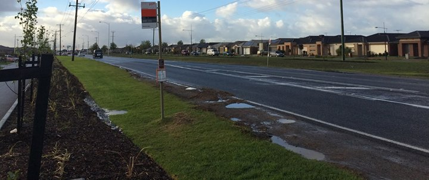



##How satisfied are you with the connectivity and infrastructure?

Let us use this platform to share your experience and feedback and see if we can raise our voice together to fix some of the issues which we are facing in our day to day life but were waiting for some initiative.

## Who are we?

We are a small community who is using route 446 bus. We are enthusiastic and passionate volunteers working with community to help solving their very local problems. We can be identifed easily with following core values.

## Our Values
- Courage
- Care
- Togetherness
- Trust
- Happy

## Does these values resonate with you?
We are not looking for gethering general crowd, however, we are keen to reach out passionate community leaders who can highlight the specific problems our community is facing using route 446 bus services as well as people who want to support us.

## Do you have any choice?
Yes you can choose any

- Do nothing, wait and watch or
- Take the lead, break the silence.

## Next steps
Here are few steps to start with rest depends on our interests and contributions.

- Provide us a feedback on the current platform.
- Please like our facebook page.
- Share your experience to the wider community.
- Upload pictures on facebook page.
- Keep a constructive discussion.
- Print and share <a href="files/Route446.v1.pdf">this page</a>.

You will be promoted to moderator of the website and facebook page once you have made a significant contribution.

## Why should you do it?

- Give a shine to your leadership skills.
- Enjoy the joy of helpig community.
- Make connections and new friends.
- Be proud of yourself.

## What if I want to share my experience with metro?
You can reach to our <a href="https://www.facebook.com/pages/Williams-Landing/941750069179333">Williams Landing</a> page.

## My recent posts

<ul class="posts">
  
    <li>{{ post.date | date_to_string }} &raquo; <a href="{{ BASE_PATH }}{{ post.url }}">{{ post.title }}</a></li>
  
</ul>

